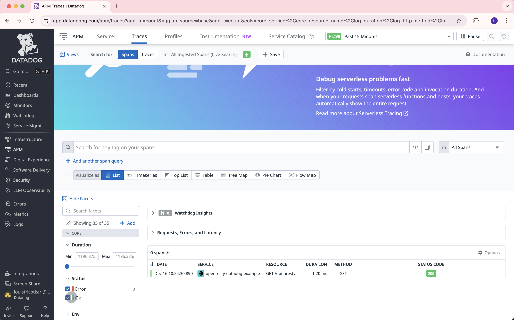

Example System
==============
This is an example of how the Datadog module adds tracing to OpenResty.

This directory is a [docker compose](https://docs.docker.com/compose) setup containing the following
services:
- `openresty` runs an instance of openresty that:
    - accepts HTTP on port 80,
    - is configured by [services/openresty/nginx.conf](services/openresty/nginx.conf).
- `client` contains the command line tools `curl`.

Because client command line tools are available within the `client` service,
this example requires only `docker compose` and a working Docker environment as
dependencies.

Usage
-----
Bring up the services by setting a Datadog API key and invoking the
[bin/run](bin/run) wrapper script:
```shell
$ export DD_API_KEY=your_api_key_here
$ bin/run
```

You can also choose which OpenResty version to run with the RESTY_VERSION environment variable:
```shell
$ RESTY_VERSION=1.27.1.1 bin/run
```

Then, in another shell, make HTTP or gRPC calls to the `openresty` service using
the included command line tools:
```shell
$ bin/curl http://openresty/openresty
openresty lua
$
```
See [services/openresty/nginx.conf](services/openresty/nginx.conf) for the available routes.

Traces will appear in the Datadog UI with the configured service name, which in this example is `openresty-datadog-example`:




OpenResty Version
-------------
The OpenResty version and target system can be specified by setting the `BASE_IMAGE`
environment variable. The value of the environment variable is the name of a
Docker image where openresty is installed or can be installed using the native
package manager.

By default, the value for `BASE_IMAGE` is the alpine version of default OpenResty
version. In this example it is `openresty/openresty:1.27.1.1-alpine`, which indicates
compatibility with Openresty 1.27.1.1 running on Alpine.

Command Line Tools
------------------
[bin/](bin/) contains the following scripts:
- [bin/run](bin/run) is a wrapper around `docker compose up`.
- [bin/curl](bin/curl) executes `curl` inside the `client` service. This way,
  `curl` has access to the network internal to `docker compose`. For example,
  `bin/curl http://openresty` sends a request to the `openresty` service, because that
  service is known by the host name "nginx" within `docker compose`.
