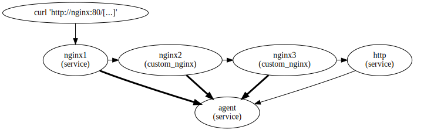
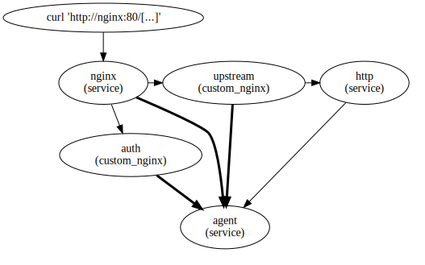

These tests verify the behavior of `datadog_delegate_sampling` directive.

## `test_sampling_delegation.py`

Each of the three nginx instances exposes endpoints that either do or don't
delegate sampling to the upstream. This test then examines the spans sent to the
agent (the bold arrows) to verify that the intended nginx instance made the
sampling decision.

## `test_add_header.py`
In order to send back the `X-Datadog-Trace-Sampling-Decision` response header,
the tracing module needs to use nginx's `add_header` directive. The `add_header`
directive is injected into the `http` block, so that it applies to all servers
and locations. However, if a configuration context (e.g. a `location`) contains
an `add_header` directive, then `add_header` directives in enclosing contexts
(e.g. `http`) are not inherited. This means that if a user uses `add_header`, it
discards to `add_header` injected by the tracing module.

To prevent this, the tracing module overrides the `add_header` directive to
include the sampling delegation response header in addition to whatever was
indicated by the user.

This test makes sure that response headers added via `add_header` do not affect
the appearance of the sampling delegation response header, and visa-versa.

## `test_auth_request.py`

Nginx's [auth_request][1] directive would interfere with the implementation of
sampling delegation if we did not give it special consideration.

Aside from implementation details, there is the question of how sampling
delegation should behave when nginx makes more than one outgoing request in
handling an incoming request. To which peer should the sampling decision be
delegated? If not the first peer, then the sampling decision received by the
first peer will in general be different from that delegated to some subsequent
peer.

The most likely example of this occurring in nginx is with the [auth_request][1]
feature. `auth_request` sends a (sub)request to the specified endpoint, and from
the response determines whether to proceed with contacting the upstream, or
otherwise deliver a 4xx error code to the client.

Datadog users probably do _not_ want to delegate the trace sampling decision to
the authentication service. It is better to delegate to the upstream, so that
nginx's spans and those of the rest of the trace are consistently sampled,
possibly with the exception of any spans produced by the authentication service.

So, the default behavior of this module is to disallow sampling delegation in
subrequests, e.g. in those subrequests made by `auth_request`.

However, since subrequests must be treated specially in the implementation in
order to prevent breaking sampling delegation in general, an option is provided
to allow sampling delegation in subrequests
(`datadog_allow_sampling_delegation_in_subrequests`). It defaults to `off`.

These tests verify that sampling delegation still works for upstreams even in
the presence of `auth_request`, and that sampling decisions can be delegated to
subrequests if `datadog_allow_sampling_delegation_in_subrequests on;`.

[1]: https://nginx.org/en/docs/http/ngx_http_auth_request_module.html#auth_request
